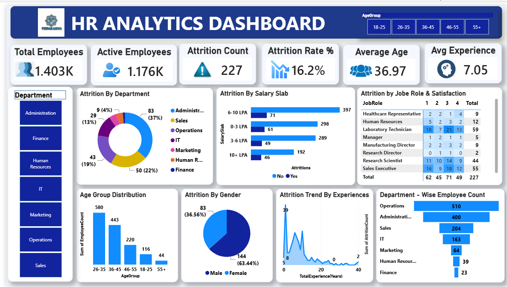

# 📊 HR Analytics Dashboard | Power BI

An interactive **HR Analytics Dashboard** built using **Power BI** to help organizations monitor workforce metrics, employee attrition, and department performance through meaningful visualizations and data-driven insights.

## 🚀 Project Overview

This dashboard provides a comprehensive view of an organization's HR data, enabling HR managers and business leaders to analyze employee demographics, monitor attrition trends, and identify key factors influencing employee turnover.

The dashboard is designed to support strategic workforce planning and improve employee retention by transforming raw HR data into actionable business insights.

---

## ✨ Dashboard Features

- 👥 Total Employees Overview
- ✅ Active Employees Tracking
- ⚠️ Employee Attrition Count
- 📉 Attrition Rate Analysis
- 🎂 Average Employee Age
- 💼 Average Years of Experience
- 🏢 Department-wise Employee Distribution
- 📊 Department-wise Attrition Analysis
- 💰 Salary Slab vs Attrition
- 😊 Job Role & Satisfaction Analysis
- 👨‍💼 Gender-wise Attrition
- 📅 Age Group Distribution
- 📈 Attrition Trend by Experience
- 🎯 Interactive Department & Age Group Filters

---

## 📌 Key Business Insights

- Identify departments with the highest employee turnover.
- Analyze attrition across different salary ranges.
- Understand how employee satisfaction impacts attrition.
- Monitor workforce demographics including age, gender, and experience.
- Compare department-wise employee strength and attrition patterns.
- Enable HR teams to make informed, data-driven decisions.

---

## 🛠️ Tools & Technologies

- **Power BI Desktop**
- **Power Query**
- **DAX (Data Analysis Expressions)**
- **Data Modeling**
- **Interactive Visualizations**

---

## 📷 Dashboard Preview



---

## 📈 KPIs Included

- Total Employees
- Active Employees
- Attrition Count
- Attrition Rate (%)
- Average Age
- Average Experience
- Department-wise Employee Count
- Department-wise Attrition
- Salary Slab Analysis
- Gender Distribution
- Age Group Analysis
- Experience-based Attrition Trend

---

## 🎯 Purpose

The objective of this project is to demonstrate how **Power BI** can be used to build an interactive HR dashboard that helps organizations monitor workforce health, identify attrition patterns, and support strategic HR decision-making.

---

## 📂 Repository Structure

```
HR-Analytics-Dashboard/
│
├── HR Analytics Dashboard.pbix
├── HR_Analytics_Dataset/
├── image/
│   └── dashboard.png
├── README.md
```

---

## ⭐ Skills Demonstrated

- Power BI Dashboard Development
- Data Cleaning & Transformation
- Data Modeling
- DAX Calculations
- HR Data Analytics
- Business Intelligence
- Interactive Reporting
- KPI Design
- Data Visualization

---

## 👩‍💻 Author

**Dilki Shanika**

If you found this project useful, feel free to ⭐ this repository!
